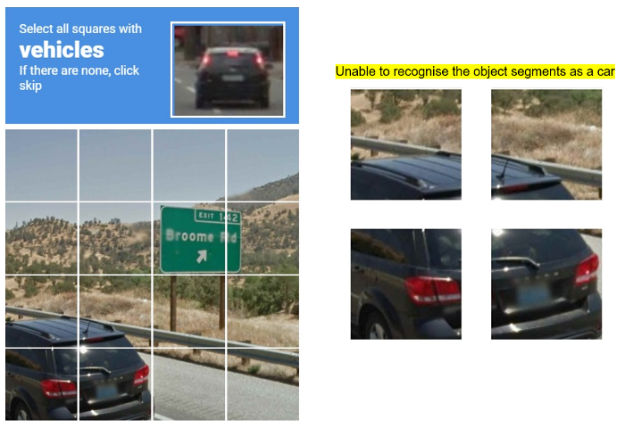

# Bypass reCAPTCHA v2
A simple program to bypass recaptcha v2 using the audio verification option. <br>
This program demonstrates how to bypass recaptcha on https://myvisit.com/#!/home/signin/.<br>
It can be easily adapted to work on other websites.<br>

## Background
reCAPTCHA is a quite a roadblock for any automation engineer.<br>
It stops us from web scraping and blocks our automation software from doing online stuff for us.<br> This is achieved by presenting “complicated” puzzles that (allegedly) only humans can understand and solve.


There are two ways to deal with a reCAPTCHA v2:
1. Solve an image recognition challenge - This challenge asks the user to identify objects in a 3 x 3 or a 4 x 4 grid.<br> It seems quite easy to solve as we have many image classification algorithms such as GoogLeNet, ResNet, and MobileNet that have been trained to classify thousands of objects. So, it shouldn’t be a problem to “select all squares with vehicles”, right? Well, it turns out we often have this kind:<br>

2. Solve an audio recognition challenge — This challenge requires the user to listen to a short, noisy audio recording and decipher<br> the “human speech” from it. Using AI to detect human speech is a very mature technology (you've probably heard of Siri, Bixby and Alexa).

I played around with and tested the following web services:
1. Google Speech Recognition
2. Google Cloud Speech API
3. Wit.ai
4. Microsoft Azure Speech Recognition
5. Houndify API
6. IBM Speech to Text

My original thought was to make an ensemble out of these and infer the reCAPTCHA passphrase by majority vote. However, Houndify was surprisingly much better than the rest so I ended up using only its services (which also meant less hassle setting everything up).

## OS support
1. Windows
2. Mac

## Requirements
* A <b>Houndify</b> [account](https://www.houndify.com/signup): update your client id & key in <i>src/houndify_creds.py</i>
* Mozilla's <b>Firefox</b> Browser

## Usage
```
python testMyVisit.py
```

## Demo


## Reference
https://ohyicong.medium.com/how-to-bypass-recaptcha-with-python-1d77a87a00d7
